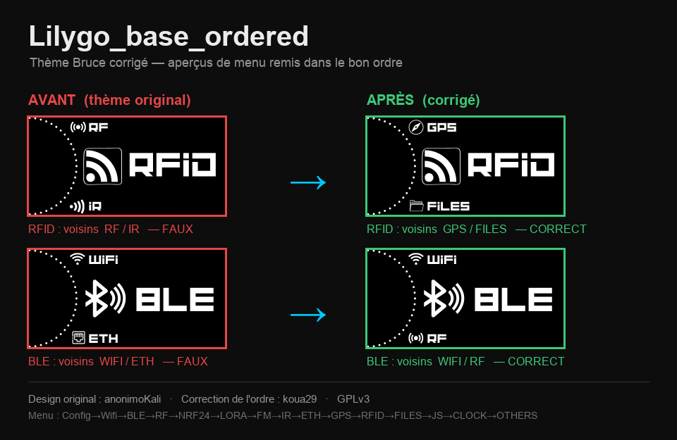
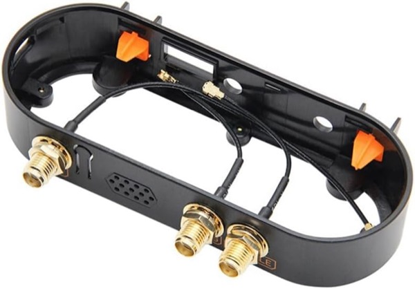

# Lilygo_base_ordered — thème Bruce (version corrigée)



Version **corrigée** du thème **`Lilygo_base`** d'[**anonimoKali**](https://github.com/anonimoKali)
pour le firmware [**Bruce**](https://github.com/BruceDevices/firmware)
(LilyGO T-Embed CC1101 et autres appareils compatibles).

> ⚠️ Ce dépôt est un **travail dérivé**. Tout le design, les icônes et le style
> originaux sont l'œuvre d'**anonimoKali**. Voir « Crédits » ci-dessous.

## Le problème corrigé

Dans le thème d'origine, chaque icône est en réalité une **capture de carrousel** :
le menu **précédent** est dessiné en haut de l'image et le menu **suivant** en bas,
autour du gros logo central.

Ces aperçus haut/bas étaient figés sur un **ordre de menu différent** de celui du
firmware Bruce actuel. Résultat à l'écran : les voisins annoncés ne correspondaient
pas au menu réellement atteint en tournant la molette — par exemple **RFID**
affichait *RF / IR* au lieu de *GPS / FILES*. Ce n'est **ni un bug de la molette,
ni du firmware** : la navigation est correcte, seules les images induisaient en erreur.

## La correction

Les **bandes haut et bas** de chaque icône ont été remappées pour refléter l'ordre
réel du menu (**haut = précédent, bas = suivant**) :

```
Config → Wifi → BLE → RF → NRF24 → LORA → FM → IR → ETH → GPS → RFID → FILES → JS → CLOCK → OTHERS → (Config)
```

- Le **logo central** de chaque icône est **inchangé**.
- Seules les mini-étiquettes voisines ont été corrigées, en réutilisant les
  éléments graphiques déjà présents dans le thème (raccords invisibles).
- Corrigé pour les **4 résolutions** : `105px`, `140px`, `180px`, `192px`.

## Installation

| Dossier | Appareil |
|---|---|
| `105px` | M5StickC Plus / Plus 2 |
| `140px` | **LilyGO T-Embed CC1101 / CC1101 Plus** |
| `180px` | Cheap Yellow Display (CYD) / T-Deck |
| `192px` | LilyGO T-LoRa-Pager |

1. Copier le dossier correspondant à ton écran dans `/themes/` de la carte SD
   (créer le dossier `/themes` s'il n'existe pas).
2. Sur l'appareil : **Settings → Themes → `Theme_Lilygo_base_ordered.json`**.

## Crédits

- **Thème original** : [anonimoKali](https://github.com/anonimoKali) —
  dépôt source : [`Bruce-Themes`](https://github.com/anonimoKali/Bruce-Themes),
  thème [`Lilygo_base_By_anonimoKali`](https://github.com/anonimoKali/Bruce-Themes/tree/main/themes/Lilygo_base_By_anonimoKali).
- **Correction de l'ordre des menus** : [koua29](https://github.com/koua29).

## Licence

**GNU GPLv3** — identique à la licence du thème d'origine. Voir [LICENSE](LICENSE).

## 🛒 Matériel / Hardware

Le matériel utilisé pour ce projet — liens affiliés Amazon :

| [](https://link.amazon/B0cgD7wou) | [](https://link.amazon/B071fmsbH) | [](https://link.amazon/B0eMlSqeZ) |
|:---:|:---:|:---:|
| 🔌 **[LilyGO T-Embed CC1101](https://link.amazon/B0cgD7wou)**<br><sub>avec antennes</sub> | ⬛ **[LilyGO T-Embed CC1101](https://link.amazon/B071fmsbH)**<br><sub>noir, sans antenne</sub> | 📡 **[Kit d'antennes SMA](https://link.amazon/B0eMlSqeZ)** |

<sub>En tant que Partenaire Amazon, je réalise un bénéfice sur les achats remplissant les conditions requises. · As an Amazon Associate I earn from qualifying purchases.</sub>
